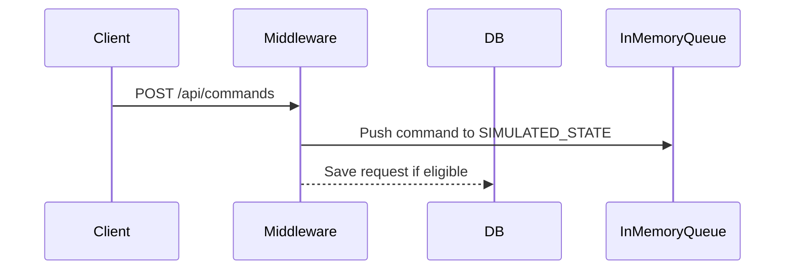

# 🛠️ Django Request Replay


## ℹ️ About

This project was built to solve a real-world challenge involving volatile stateful systems in production environments. It combines a Django middleware for request logging and a simulation of an in-memory command queue to enable robust state reproduction and debugging capabilities.

The key motivation behind this project was the inability of standard logging or monitoring tools to accurately replicate the conditions that led to internal server errors or data loss after reboots. By capturing and persisting relevant API requests, this system allows developers and DevOps teams to restore system state, investigate issues thoroughly, and simulate critical workflows.

> “Replay” in this context refers to re-executing previously logged API requests to simulate or restore a previous system state.

**Target Audience**: Backend developers, DevOps engineers, QA teams, and anyone working with stateful Django systems.

---

## 📌 Project Overview

In a recent project, our team encountered a significant challenge with a **stateful system** that would revert to factory settings after reboots or power losses. Additionally, there was a need for a mechanism to **accurately reproduce system states** for debugging purposes when customers encountered internal server errors. Traditional methods like system logs and error-tracking tools such as Sentry were insufficient for replicating exact requests in a raw debugging environment.

### My Approach to Fix it

To tackle this issue, I developed a middleware solution within our Django Backend Core. This middleware was designed to record and save essential API requests to the database. This approach enabled us to restore the system to its last known state by replaying these saved requests. The middleware was engineered to capture request details upon their arrival, selectively save them based on predefined criteria, and utilize this data for effective system restoration.

This solution not only resolved the immediate issue of system state preservation but also enhanced our debugging capabilities, allowing for a more reliable and maintainable system.

### Code Workflow Summary

- **Capture API Request Details**: When an API request is received by the Django web service, the middleware immediately captures its details.
- **Evaluate Saving Criteria**: The middleware then evaluates whether the request meets the criteria to be saved (based on its method and the response status).
- **Database Saving**: If the request is savable, the middleware creates an instance of `DjangoRequestsHistoryModel` and commits the request details to the database.

---

## ✅ Architecture Overview

### 1. `request_logger` App
- Contains the custom middleware to track API requests.
- Uses `DjangoRequestsHistoryModel` to store request/response data persistently.
- Controlled via flexible Django settings for request filtering and customization.

### 2. `command_queue_simulation` App
- Simulates a volatile stateful system with an in-memory command queue (`SIMULATED_STATE`).
- Exposes endpoints that accept and store commands temporarily (cleared on reboot).

---

## 🗺️ Architecture Diagram



---

## 🧩 Replay Tool: `cli/apply_history_db.py`

When a command like the following is POSTed:

```http
POST /api/commands
{
  "command": "restart wifi"
}
```

It is stored in memory (`SIMULATED_STATE`) and logged persistently if eligible.

To **replay** such logged requests and restore the system’s last known state, use the provided standalone script:

📄 Located under the `cli/` directory next to `manage.py`:
```
django_request_replay/
├── manage.py
├── cli/
│   └── apply_history_db.py
```

### Example usage:
```bash
python3 cli/apply_history_db.py \
    --db-file ./django_request_replay/db.sqlite3 \
    --base-url http://127.0.0.1:8000 \
    --excluded-urls /api/v1/health/ /api/v1/internal/
```

### Features:
- Replays critical API requests for recovery or debugging
- Supports interactive and dry-run modes
- Filters requests by method, path, and ID range
- Works independently of Django runtime

---

## ⚙️ Configuration

All settings are placed in `settings.py`:

```python
DJANGO_REQUESTS_HISTORY_ENABLE = True
DJANGO_REQUESTS_HISTORY_SAVABLE_REQUEST_METHODS = ('POST', 'PATCH', 'PUT', 'DELETE')
DJANGO_REQUESTS_HISTORY_EXCLUDING_URL_NAMES = ()
DJANGO_REQUESTS_HISTORY_VIEW_FILTER = {}
DJANGO_REQUESTS_HISTORY_VIEW_ORDER_BY = "created"
DJANGO_REQUESTS_HISTORY_VISIBLE_COLUMNS = "__all__"
```

---

## 🚀 Features

- Smart request filtering based on settings
- Records request/response metadata (method, path, user, IP, status)
- Pluggable middleware for use in any Django project
- Compatible with Django Admin or custom dashboards

---

## 🏁 Getting Started

```bash
git clone git@github.com:omidcodes/django-request-replay.git
cd django-request-replay
pip install -r requirements.txt

python manage.py migrate
python manage.py runserver
```

➡️ **Don’t forget to add the middleware in `settings.py`:**

```python
MIDDLEWARE += [
    'request_logger.middlewares.DjangoRequestsHistoryMiddleware',
]
```

➡️ API Docs available at: [http://127.0.0.1:8000/api/docs/swagger/#/](http://127.0.0.1:8000/api/docs/swagger/#/)

---

## 📂 Project Structure

```
├── manage.py
├── cli/
│   └── apply_history_db.py       # Standalone request replayer script
├── request_logger/
│   ├── middlewares.py            # Request logging middleware
│   ├── models.py                 # DjangoRequestsHistoryModel
│   ├── conf.py                   # Configuration parser
│   └── ...
├── command_queue_simulation/
│   ├── views.py                  # Simulated in-memory queue logic
│   └── ...
```

> This reflects the core logic — not all files are shown.

---

## 🔄 Future Improvements

- Admin view with dynamic filters and labels
- Queryable replay history dashboard

---

## 🤝 Contributing

Pull requests are welcome! For major changes, please open an issue first to discuss what you would like to change.

1. Fork the repository
2. Create your feature branch (`git checkout -b feature/my-feature`)
3. Commit your changes
4. Push to the branch
5. Open a Pull Request

---

## 🧪 Running Tests

```bash
python manage.py test
```

---

## © License

MIT License

> Built by **Omid Hashemzadeh** for better system observability and state resilience in Django-based backends.